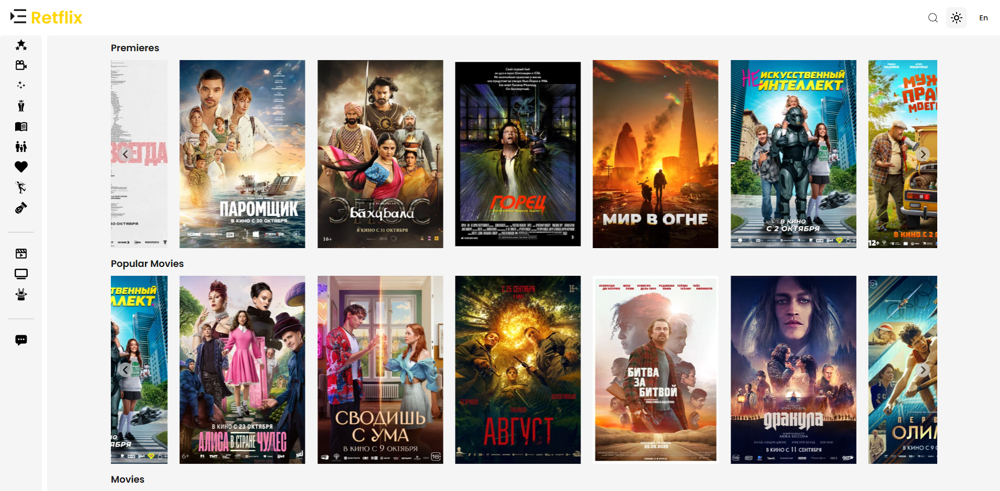

# 🎬 Retflix

**Retflix** is your ultimate destination for streaming movies and TV shows online.

Enjoy a sleek, modern, and fully responsive interface for discovering, watching your favorite films and series.

🌐 **Live Demo:** [click](https://retflix2-0.vercel.app/)



## 🧰 Tech Stack

Retflix is built using a modern and efficient technology stack to ensure high performance, scalability, and
maintainability.

- **Next.js** — for server-side rendering and routing
- **React** — for building fast and interactive UI components
- **Zustand** — for lightweight and flexible state management
- **TanStack React Query** — for efficient data fetching and caching
- **Axios** — for handling API requests
- **React Icons** — for consistent and modern iconography
- **@splidejs/react-splide** — for smooth and responsive carousels
- **next-intl** — for internationalization and localization support
- **Prisma ORM** — for database management and queries
- **jsonwebtoken** — for secure authentication
- **lru-cache** — for caching frequently accessed data
- **TypeScript** — for type safety and better developer experience
- **ESLint & Prettier** — for code linting and formatting
- **Storybook** — for UI component documentation and testing
- **Jest** — for unit and integration testing
- **Husky** — for pre-commit hooks and code quality enforcement
- **Stylelint** — for consistent and clean CSS

---

## 🧱 Architecture

The project is built following the **Feature-Sliced Design (FSD)** methodology — a modern and scalable approach to
structuring frontend applications.  
This helps keep the codebase clean, maintainable, and easy to extend as the project grows.

📚 **Learn more:** [Feature-Sliced Design](https://feature-sliced.design/)

---

## 🌍 Internationalization

The project uses **next-intl** for managing translations and handling internationalization (i18n) in Next.js.  
This library provides a simple and efficient way to localize both server and client components while maintaining great
performance.

🗂️ All translation files are stored in the **`/messages`** directory, organized by locale (e.g., `en.json`, `ru.json`,
etc.).  
This structure allows easy addition of new languages and seamless switching between them.

📚 **Documentation:** [next-intl](https://next-intl-docs.vercel.app/)

---

## ⚙️ CI Pipeline & Pre-Commit Hooks

The project includes a fully automated **CI/CD pipeline** configured via **GitHub Actions**.  
The configuration files are located in **`/.github/workflows`**.

During the CI process, the following checks are performed:

- ✅ All types of tests
- 🧱 Project build and Storybook build
- 🔍 Code linting and formatting validation

To maintain consistent code quality, **pre-commit hooks** are configured with **Husky**.  
Before each commit, the following tasks are automatically executed:

- 🧩 ESLint and Stylelint checks

Configuration files are located in **`/.husky`**.

---

## 🚀 Project Setup

### **1. Install dependencies and start the project**

To get started with Retflix locally:

```bash
npm install     # Install all dependencies
npm run dev     # Start the project in development mode 
```

### **2. Configure environment variables**

Create a  **`.env`** file in the root directory and add the following variables:

```
NEXT_PUBLIC_API_URL=/api
JWT_SECRET=supersecretkey
NEXT_PUBLIC_KINOPOISK_BASE_URL=https://kinopoiskapiunofficial.tech/api/
NEXT_PUBLIC_KINOPOISK_API_KEY=your_api_key
DATABASE_URL=your_postgresql_database_url #PostgreSQL (e.g., Neon)
```
